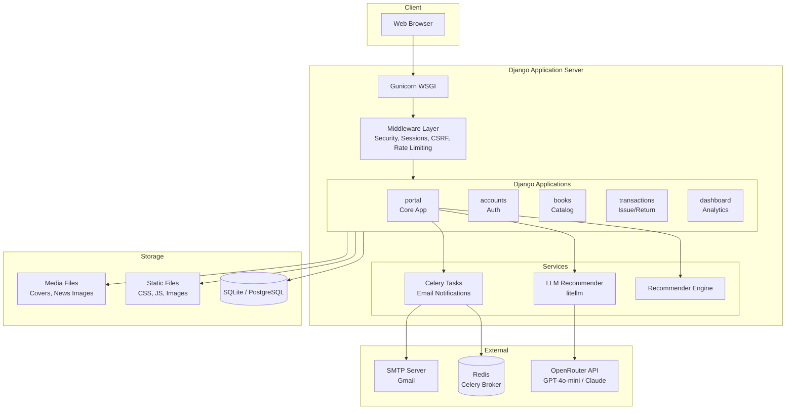
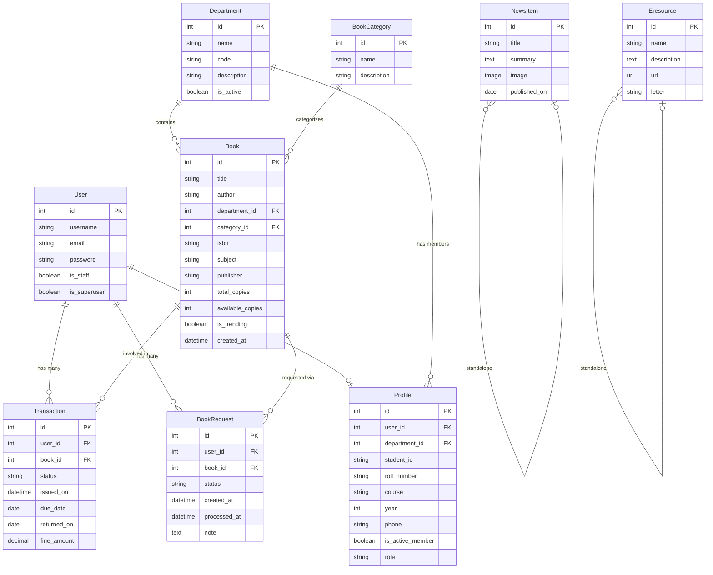

# Product Requirements Document (PRD)
# ANU Library Management System (ANU LMS)

---

| **Field**              | **Details**                                                     |
|------------------------|-----------------------------------------------------------------|
| **Product Name**       | ANU Library Management System (ANU LMS)                        |
| **Version**            | 1.1                                                             |
| **Date**               | February 23, 2026                                               |
| **Organization**       | Acharya Nagarjuna University                                    |
| **Framework**          | Django 4.2.7 (Python)                                           |
| **Database**           | PostgreSQL 17 (migrated from SQLite)                            |
| **Status**             | Core functionality implemented; PostgreSQL migration complete   |

---

## Table of Contents

1. [Executive Summary](#1-executive-summary)
2. [Product Vision & Objectives](#2-product-vision--objectives)
3. [Target Users & Personas](#3-target-users--personas)
4. [Functional Requirements](#4-functional-requirements)
5. [Non-Functional Requirements](#5-non-functional-requirements)
6. [System Architecture](#6-system-architecture)
7. [Data Model](#7-data-model)
8. [User Interface & Pages](#8-user-interface--pages)
9. [API Endpoints](#9-api-endpoints)
10. [Technology Stack](#10-technology-stack)
11. [Security Requirements](#11-security-requirements)
12. [Performance Requirements](#12-performance-requirements)
13. [Deployment & Infrastructure](#13-deployment--infrastructure)
14. [Current Status & Completed Features](#14-current-status--completed-features)
15. [Future Roadmap](#15-future-roadmap)
16. [Assumptions & Constraints](#16-assumptions--constraints)
17. [Glossary](#17-glossary)

---

## 1. Executive Summary

The **ANU Library Management System (ANU LMS)** is a comprehensive, web-based library management platform built for **Acharya Nagarjuna University**. It digitizes and streamlines the end-to-end library workflow — from book cataloging and search to issuing, returning, fine management, and AI-powered recommendations.

The system serves three primary user roles — **Students**, **Librarians**, and **Admins** — each with tailored dashboards, permissions, and workflows. It also includes e-resource management, university news/announcements, analytics dashboards with exportable reports, and asynchronous email notifications via Celery.

---

## 2. Product Vision & Objectives

### Vision
To provide a modern, intelligent, and user-friendly digital library platform that enhances the academic experience at Acharya Nagarjuna University by making library resources easily accessible and efficiently managed.

### Objectives

| # | Objective                                                                 | Priority |
|---|---------------------------------------------------------------------------|----------|
| 1 | Digitize the complete book issue/return lifecycle with automatic fine calculation | **P0** |
| 2 | Provide role-based dashboards with actionable KPIs and analytics          | **P0** |
| 3 | Enable fast, intelligent book discovery via search and AI recommendations | **P0** |
| 4 | Streamline librarian operations (stock alerts, overdue tracking, request management) | **P0** |
| 5 | Deliver a responsive, mobile-friendly interface with dark mode support    | **P1** |
| 6 | Automate email notifications for overdue reminders and request approvals  | **P1** |
| 7 | Provide data export capabilities (CSV, PDF) for administrative reporting  | **P1** |
| 8 | Offer e-resource access and university news/announcements within the platform | **P2** |

---

## 3. Target Users & Personas

### 3.1 Student
- **Description**: Undergraduate/postgraduate students enrolled at ANU.
- **Goals**: Search and discover books, issue/return books, track borrowing history, receive personalized recommendations, view fines, request unavailable books.
- **Access**: Student Dashboard, Book Catalog, My Books, My Requests, E-Resources, News.
- **Credentials Format**: Roll Number (e.g., `2022CSE001`) / Password.

### 3.2 Librarian
- **Description**: Library staff responsible for day-to-day operations.
- **Goals**: Manage book issues/returns, process book requests, monitor overdue books and low-stock inventory, track fines.
- **Access**: Librarian Dashboard, Issue/Return Book, Manage Requests, Book Catalog (edit), Reports.
- **Credentials Format**: Staff ID (e.g., `LIB001`) / Password.

### 3.3 Admin (Super Administrator)
- **Description**: University administrators with full system access.
- **Goals**: View organization-wide KPIs, analyze trends, export reports, manage all users and data, configure system settings.
- **Access**: Admin Dashboard (full analytics), all Librarian features, Django Admin panel, data exports.
- **Credentials Format**: `admin` / Password.

---

## 4. Functional Requirements

### 4.1 Authentication & User Management

| ID    | Requirement                                                                     | Status |
|-------|---------------------------------------------------------------------------------|--------|
| FR-01 | User registration with role assignment (Student, Librarian, Admin)             | ✅ Done |
| FR-02 | Login/logout with Django's `AuthenticationForm` and session management          | ✅ Done |
| FR-03 | Role-based access control using `@login_required` and `user_passes_test`        | ✅ Done |
| FR-04 | User profile management (update personal details, phone, department)            | ✅ Done |
| FR-05 | Profile picture upload via `Pillow`                                             | ✅ Done |
| FR-06 | Change password functionality with session hash update                          | ✅ Done |
| FR-07 | Post-login redirect based on user role (student → student dashboard, etc.)     | ✅ Done |

### 4.2 Book Catalog & Discovery

| ID    | Requirement                                                                     | Status |
|-------|---------------------------------------------------------------------------------|--------|
| FR-08 | Book listing with pagination (12 items per page)                                | ✅ Done |
| FR-09 | Basic search by title, author, and subject with `Q` objects                     | ✅ Done |
| FR-10 | Advanced search with filters: department, category, availability, year, language | ✅ Done |
| FR-11 | AJAX-powered search suggestions (top 5 matches)                                 | ✅ Done |
| FR-12 | Book detail page with metadata, availability, similar books, and cover image    | ✅ Done |
| FR-13 | Department-wise book browsing                                                   | ✅ Done |
| FR-14 | Curated sections on homepage: Trending, Classics, Romance, Kids, Thriller       | ✅ Done |
| FR-15 | Dedicated pages: Trending Books, New Arrivals, Rare Books, Theses/Dissertations, ANU Archives | ✅ Done |

### 4.3 Book Issue & Return

| ID    | Requirement                                                                     | Status |
|-------|---------------------------------------------------------------------------------|--------|
| FR-16 | Book issue with validation (available copies > 0, borrow limit ≤ 5)            | ✅ Done |
| FR-17 | Automatic due date calculation (14 days from issue)                              | ✅ Done |
| FR-18 | Book return with automatic fine calculation for overdue books                    | ✅ Done |
| FR-19 | Real-time available copy count update on issue/return                            | ✅ Done |
| FR-20 | Duplicate issue prevention (no active loan for same book by same user)           | ✅ Done |
| FR-21 | Transaction history tracking (issued on, due date, returned on, fine amount)    | ✅ Done |

### 4.4 Book Requests

| ID    | Requirement                                                                     | Status |
|-------|---------------------------------------------------------------------------------|--------|
| FR-22 | Students can request unavailable books                                          | ✅ Done |
| FR-23 | Librarians/Admins can approve or reject requests with notes                     | ✅ Done |
| FR-24 | Request status tracking (Pending → Approved/Rejected)                          | ✅ Done |
| FR-25 | My Requests page for students to track request history                          | ✅ Done |
| FR-26 | Manage Requests page for librarians with bulk processing                        | ✅ Done |

### 4.5 Dashboards & Analytics

| ID    | Requirement                                                                     | Status |
|-------|---------------------------------------------------------------------------------|--------|
| FR-27 | **Student Dashboard**: Current issued books, fines, recommendations, history    | ✅ Done |
| FR-28 | **Librarian Dashboard**: Low stock alerts, overdue books, recent transactions   | ✅ Done |
| FR-29 | **Admin Dashboard**: KPIs (total books, users, issues, overdues, fines)         | ✅ Done |
| FR-30 | Monthly trend analytics using `TruncMonth` aggregations                         | ✅ Done |
| FR-31 | Department-wise issue statistics                                                | ✅ Done |
| FR-32 | Most issued books ranking                                                       | ✅ Done |
| FR-33 | Export transactions to CSV                                                       | ✅ Done |
| FR-34 | Export transactions to PDF (via `ReportLab`)                                    | ✅ Done |

### 4.6 AI-Powered Recommendations

| ID    | Requirement                                                                     | Status |
|-------|---------------------------------------------------------------------------------|--------|
| FR-35 | Layered recommendation engine: content-based, collaborative, popularity-based  | ✅ Done |
| FR-36 | Weighted scoring (40% content, 40% collaborative, 20% popularity)              | ✅ Done |
| FR-37 | Cold-start fallback (department popular → global top books)                    | ✅ Done |
| FR-38 | Per-user recommendation caching (3600s TTL)                                     | ✅ Done |
| FR-39 | LLM-based recommendations via `litellm` with retry/backoff and model failover  | ✅ Done |
| FR-40 | Similar books section on book detail page                                       | ✅ Done |

### 4.7 E-Resources & News

| ID    | Requirement                                                                     | Status |
|-------|---------------------------------------------------------------------------------|--------|
| FR-41 | E-Resource catalog with A–Z alphabetical navigation                            | ✅ Done |
| FR-42 | E-Resource detail (name, description, external URL link)                        | ✅ Done |
| FR-43 | News/announcements page with title, summary, image, and publish date           | ✅ Done |

### 4.8 Library Services & Information

| ID    | Requirement                                                                     | Status |
|-------|---------------------------------------------------------------------------------|--------|
| FR-44 | Contact information page                                                        | ✅ Done |
| FR-45 | Library opening hours (multi-branch)                                            | ✅ Done |
| FR-46 | "Ask a Librarian" query submission form                                         | ✅ Done |
| FR-47 | Study room booking information/form                                             | ✅ Done |

### 4.9 Notifications

| ID    | Requirement                                                                     | Status |
|-------|---------------------------------------------------------------------------------|--------|
| FR-48 | Async overdue reminder emails via Celery (daily at 9 AM)                        | ✅ Done |
| FR-49 | Book request approval/rejection email notifications                             | ✅ Done |
| FR-50 | Console email backend for development; Gmail SMTP ready for production           | ✅ Done |

---

## 5. Non-Functional Requirements

| ID     | Category        | Requirement                                                      |
|--------|-----------------|------------------------------------------------------------------|
| NFR-01 | Performance     | Page load time < 2 seconds for typical operations                |
| NFR-02 | Performance     | Support 100+ concurrent users with Gunicorn multi-worker setup   |
| NFR-03 | Scalability     | Database-agnostic (SQLite dev → PostgreSQL production)           |
| NFR-04 | Reliability     | AI recommendations must never crash views (graceful fallback)    |
| NFR-05 | Usability       | Responsive design; mobile-friendly with touch-friendly elements  |
| NFR-06 | Usability       | Dark mode support                                                |
| NFR-07 | Usability       | Loading indicators for AJAX calls; clear error/validation messages |
| NFR-08 | Availability    | Production deployment with Gunicorn + PostgreSQL + Redis         |
| NFR-09 | Maintainability | Modular Django app architecture (portal, accounts, books, transactions, dashboard) |
| NFR-10 | Observability   | Structured logging to console + file (`logs/django_error.log`)   |

---

## 6. System Architecture

### 6.1 High-Level Architecture



### 6.2 Django Application Modules

| Module          | Responsibility                                                        |
|-----------------|-----------------------------------------------------------------------|
| `portal`        | Core app: models, views, forms, templates, URLs, services, admin      |
| `accounts`      | User registration, login/logout, profile management, password change  |
| `books`         | Book-related extensions and management commands                       |
| `transactions`  | Issue/return transaction processing                                   |
| `dashboard`     | Analytics dashboard views and data aggregation                        |
| `anu_lms`       | Django project configuration (settings, URLs, WSGI/ASGI, Celery)      |

---

## 7. Data Model

### 7.1 Entity Relationship Summary



### 7.2 Key Business Rules

| Rule                          | Details                                                          |
|-------------------------------|------------------------------------------------------------------|
| **Borrow Limit**              | Maximum 5 books per student at a time (`MAX_BORROW = 5`)        |
| **Loan Period**               | 14 days from issue date                                          |
| **Fine Calculation**          | Daily rate applied for each overdue day                          |
| **Transaction Statuses**      | `ISSUED` → `RETURNED`                                           |
| **Request Statuses**          | `PENDING` → `APPROVED` / `REJECTED`                             |
| **Copy Management**           | `available_copies` decremented on issue, incremented on return   |
| **Duplicate Prevention**      | A user cannot issue or request the same book they already have   |

---

## 8. User Interface & Pages

### 8.1 Page Inventory

| Page                     | URL Pattern                        | Access          | Description                                    |
|--------------------------|------------------------------------|-----------------|-------------------------------------------------|
| Home                     | `/`                                | Public          | Hero search, curated book sections, news        |
| Login                    | `/login/`                          | Public          | Authentication form                             |
| Sign Up                  | `/signup/`                         | Public          | User registration                               |
| Book List                | `/books/`                          | Public          | Paginated book catalog with filters             |
| Book Detail              | `/books/<id>/`                     | Public          | Full book info, similar books, availability     |
| Search Results           | `/search/`                         | Public          | Basic search results                             |
| Advanced Search          | `/advanced-search/`                | Public          | Multi-criteria search with filters              |
| Department List          | `/departments/`                    | Public          | Active departments with book stats              |
| Department Books         | `/departments/<id>/books/`         | Public          | Books filtered by department                    |
| Trending Books           | `/trending-books/`                 | Public          | Curated trending collection                      |
| New Arrivals             | `/new-arrivals/`                   | Public          | Recently added books                             |
| Rare Books               | `/rare-books/`                     | Public          | Rare and special books                           |
| Theses & Dissertations   | `/theses-dissertations/`           | Public          | Academic theses collection                       |
| ANU Archives             | `/anu-archives/`                   | Public          | University archives                              |
| E-Resources              | `/eresources/<letter>/`            | Public          | Digital resources by A–Z                        |
| News                     | `/news/`                           | Public          | University news and announcements               |
| Contact                  | `/contact/`                        | Public          | Library contact details                          |
| Opening Hours            | `/opening-hours/`                  | Public          | Multi-branch operating hours                    |
| Ask Librarian            | `/ask-librarian/`                  | Public          | Query submission form                            |
| Book Study Room          | `/book-study-room/`               | Public          | Room booking info/form                           |
| Student Dashboard        | `/student-dashboard/`              | Student         | Issued books, fines, recommendations, history   |
| Librarian Dashboard      | `/librarian-dashboard/`            | Librarian       | Low stock, overdues, recent transactions        |
| Admin Dashboard          | `/admin-dashboard/`                | Admin           | KPIs, trends, dept stats, exports               |
| My Books                 | `/my-books/`                       | Authenticated   | Current issued books with return option         |
| My Requests              | `/my-requests/`                    | Authenticated   | Student's book request history                  |
| Issue Book               | `/issue-book/`                     | Staff           | Issue a book to a student                        |
| Return Book              | `/return-book/<tx_id>/`            | Staff           | Process a book return with fine                  |
| Request Book             | `/request-book/<book_id>/`         | Student         | Submit request for unavailable book              |
| Manage Requests          | `/manage-requests/`                | Staff           | Approve/reject pending requests                 |
| Export CSV               | `/export-transactions-csv/`        | Admin           | Download transaction report as CSV              |
| Export PDF               | `/export-transactions-pdf/`        | Admin           | Download transaction report as PDF              |

---

## 9. API Endpoints

All API endpoints return JSON responses and are used by dashboard charts and dynamic UI components.

| Endpoint                          | Method | Description                                 |
|-----------------------------------|--------|---------------------------------------------|
| `/api/dashboard/stats/`           | GET    | Overall KPI statistics                      |
| `/api/department-issues/`         | GET    | Issue count per department                  |
| `/api/monthly-trends/`            | GET    | Monthly issue/return trends                 |
| `/api/most-issued-books/`         | GET    | Top most-issued books                       |
| `/api/overdue-books/`             | GET    | Currently overdue books list                |
| `/api/low-stock-books/`           | GET    | Books with low available copies             |
| `/api/student-issued/`            | GET    | Current student's issued books              |
| `/api/student-history/`           | GET    | Current student's transaction history       |
| `/search-suggestions/`            | GET    | AJAX search autocomplete suggestions        |

---

## 10. Technology Stack

| Layer               | Technology                                                              |
|----------------------|-------------------------------------------------------------------------|
| **Backend**          | Python 3.10+, Django 4.2.7                                             |
| **Database**         | PostgreSQL 17 via `psycopg2-binary 2.9.7` (migrated from SQLite)       |
| **Search**           | PostgreSQL Full-Text Search (`SearchVector`, `SearchQuery`, `SearchRank`) |
| **Connection Pooling** | Django persistent connections (`CONN_MAX_AGE=600`)                    |
| **Task Queue**       | Celery 5.3.4 + Redis 5.0.1 + django-celery-beat 2.5.0                 |
| **AI/ML**            | `litellm` (OpenRouter — GPT-4o-mini, Claude 3 Haiku fallback)         |
| **PDF Generation**   | ReportLab 4.0.7                                                        |
| **Image Processing** | Pillow 10.1.0                                                          |
| **Rate Limiting**    | django-ratelimit 4.1.0                                                 |
| **WSGI Server**      | Gunicorn 21.2.0                                                        |
| **Frontend**         | HTML5, CSS3, JavaScript (vanilla), Django Templates, Bootstrap 5.3     |
| **Caching**          | Django LocMemCache (dev), Redis (production-ready)                     |

---

## 11. Security Requirements

| ID     | Requirement                                                                   | Status |
|--------|-------------------------------------------------------------------------------|--------|
| SR-01  | CSRF protection on all forms                                                 | ✅      |
| SR-02  | Password hashing via Django's built-in auth (PBKDF2)                         | ✅      |
| SR-03  | Role-based access with `@login_required` and `user_passes_test` decorators   | ✅      |
| SR-04  | Rate limiting on search endpoints                                             | ✅      |
| SR-05  | Security headers: HSTS, X-Content-Type-Options, X-XSS-Protection            | ✅      |
| SR-06  | `SECURE_SSL_REDIRECT` enabled in production (`DEBUG=False`)                  | ✅      |
| SR-07  | Secure cookie settings (`CSRF_COOKIE_SECURE`, `SESSION_COOKIE_SECURE`)       | ✅      |
| SR-08  | `X_FRAME_OPTIONS = 'DENY'` (clickjacking protection)                        | ✅      |
| SR-09  | Secret key managed via environment variable                                   | ✅      |
| SR-10  | Password strength validators (min length 8, common password check, etc.)     | ✅      |
| SR-11  | Referrer policy: `strict-origin-when-cross-origin`                           | ✅      |

---

## 12. Performance Requirements

| ID     | Requirement                                                                   | Status |
|--------|-------------------------------------------------------------------------------|--------|
| PR-01  | Database indexing on all frequently queried fields (`db_index=True`)         | ✅      |
| PR-02  | `select_related` for FK joins to prevent N+1 queries                         | ✅      |
| PR-03  | Pagination on all list views (12–20 items per page)                          | ✅      |
| PR-04  | Caching: dashboard stats (300s), recommendations (3600s per user)            | ✅      |
| PR-05  | Gunicorn with 3 workers for parallel request handling                        | ✅      |
| PR-06  | Aggregate queries (`Count`, `Sum`, `TruncMonth`) instead of Python loops     | ✅      |
| PR-07  | AI recommendations wrapped in try/except with silent fallback                | ✅      |
| PR-08  | PostgreSQL Full-Text Search with `SearchVector`/`SearchRank`                 | ✅      |
| PR-09  | Persistent DB connections via `CONN_MAX_AGE=600`                             | ✅      |
| PR-10  | Bulk transaction generation with `bulk_create`/`bulk_update`                 | ✅      |

---

## 13. Deployment & Infrastructure

### 13.1 Development Environment
```
Python 3.10+ → virtualenv → pip install -r requirements.txt
PostgreSQL 17 → CREATE ROLE lms WITH LOGIN PASSWORD 'postgres' CREATEDB;
              → CREATE DATABASE anu_lms OWNER lms;
python manage.py migrate
python manage.py seed_all (imports all data + creates admin superuser)
Console email backend for testing
python manage.py runserver → http://127.0.0.1:8000/
```

### 13.2 Production Environment
```
PostgreSQL database (env: DB_ENGINE, DB_NAME, DB_USER, DB_PASSWORD, DB_HOST, DB_PORT)
Connection pooling: CONN_MAX_AGE=600 (persistent connections)
Redis for Celery broker and cache (env: REDIS_URL)
Gunicorn WSGI with 3+ workers
DEBUG=False, SECRET_KEY via env var
ALLOWED_HOSTS configured
SSL/HTTPS enabled
Static files: collectstatic → served via whitenoise or nginx
```

### 13.3 Database Configuration (`settings.py`)
```python
DATABASES = {
    "default": {
        "ENGINE": os.environ.get('DB_ENGINE', "django.db.backends.postgresql"),
        "NAME": os.environ.get('DB_NAME', "anu_lms"),
        "USER": os.environ.get('DB_USER', 'lms'),
        "PASSWORD": os.environ.get('DB_PASSWORD', 'postgres'),
        "HOST": os.environ.get('DB_HOST', 'localhost'),
        "PORT": os.environ.get('DB_PORT', '5432'),
        "CONN_MAX_AGE": 600,
        "OPTIONS": {"connect_timeout": 10},
    }
}
```

### 13.4 Data Seeding Commands
| Command                                      | Description                                         |
|----------------------------------------------|-----------------------------------------------------|
| `python manage.py seed_all`                  | **Master command** — runs all imports + creates admin |
| `python manage.py seed_all --tx-count 5000`  | Seed with custom transaction count                  |
| `python manage.py seed_all --skip-transactions` | Seed without generating transactions             |
| `python manage.py import_departments`        | Load 18 departments from CSV                        |
| `python manage.py import_categories`         | Load 12 book categories from CSV                    |
| `python manage.py import_books`              | Load 95+ books from CSV                             |
| `python manage.py import_users`              | Load 48 users & profiles from CSV                   |
| `python manage.py import_eresources`         | Load e-resources from CSV                           |
| `python manage.py import_news`               | Load 15 news items from CSV                         |
| `python manage.py generate_transactions`     | Generate 3000 synthetic transactions (bulk-optimized) |
| `python manage.py generate_transactions --cleanup` | Clear all transactions and regenerate        |

---

## 14. Current Status & Completed Features

### ✅ Fully Implemented
- User authentication & registration with role-based access
- Complete book catalog with search (basic + advanced + AJAX suggestions)
- **PostgreSQL Full-Text Search** with `SearchVector`/`SearchQuery`/`SearchRank`
- Book issue/return lifecycle with automatic fine calculation
- Book request workflow (student request → librarian approval)
- Three role-based dashboards (Student, Librarian, Admin)
- AI recommendation engine (rule-based + LLM-based with fallback)
- Per-user recommendation caching
- E-Resources catalog with A–Z navigation
- News and announcements
- Library services pages (Contact, Opening Hours, Ask Librarian, Study Rooms)
- Department browsing with statistics
- Curated collections (Trending, New Arrivals, Rare, Theses, Archives)
- Transaction export (CSV + PDF)
- Async email notifications via Celery (overdue reminders, request approvals)
- Responsive design with dark mode
- Database indexing and query optimization
- Structured logging
- Security hardening (headers, rate limiting, secure cookies)
- Data seeding pipeline (9 management commands + `seed_all` orchestrator)
- **PostgreSQL migration** (from SQLite) with connection pooling
- **Bulk-optimized transaction generation** (`bulk_create`/`bulk_update`)
- **Environment variable template** (`.env.example`)

---

## 15. Future Roadmap

### Phase 1 — High Priority (Next Sprint)

| Feature                     | Description                                                          |
|-----------------------------|----------------------------------------------------------------------|
| Book Reservations           | Queue system for unavailable books with notifications and expiry     |
| Two-Factor Authentication   | 2FA for enhanced login security                                      |
| Manual Testing Completion   | Full role, mobile, and cross-browser testing                         |

### Phase 2 — Medium Priority

| Feature                     | Description                                                          |
|-----------------------------|----------------------------------------------------------------------|
| Advanced Filters            | Publication year, language, book type filters + faceted search       |
| Enhanced Analytics          | Charts, user activity trends, popularity analytics, dept-wise stats  |
| HTTPS/SSL                   | Full SSL implementation with HSTS                                    |
| Data Protection             | Encryption at rest, GDPR compliance, audit logging                   |

### Phase 3 — Long-Term

| Feature                     | Description                                                          |
|-----------------------------|----------------------------------------------------------------------|
| CI/CD Pipeline              | GitHub Actions for automated testing and deployment                  |
| Monitoring                  | Prometheus/Grafana, Django Silk, error alerting                      |
| Accessibility               | WCAG compliance, screen reader support, keyboard navigation          |
| Mobile App                  | React Native or Flutter companion app                                |
| University Integration      | SIS/LDAP integration for single sign-on                              |
| Multi-Language Support      | Internationalization (i18n) for Telugu and Hindi                     |
| Docker Containerization     | Full Docker Compose setup for one-command deployment                 |

### Technical Debt

- Refactor `views.py` (841 lines) into class-based views or separate modules
- Implement proper error handling across all views
- Standardize API response formats
- Add comprehensive input validation
- Increase test coverage to 80%+

---

## 16. Assumptions & Constraints

### Assumptions
- Users have access to modern web browsers (Chrome, Firefox, Edge, Safari).
- The university provides network infrastructure for hosting.
- Students are pre-registered in the university system and assigned roll numbers.
- Internet connectivity is available for LLM-based AI recommendations.

### Constraints
- The current LLM recommendations depend on external API availability (OpenRouter).
- Celery requires a running Redis instance for async task processing.
- No offline mode is currently supported.
- The system is English-only at present.

---

## 17. Glossary

| Term               | Definition                                                                 |
|--------------------|----------------------------------------------------------------------------|
| **ANU**            | Acharya Nagarjuna University                                              |
| **LMS**            | Library Management System                                                 |
| **OPAC**           | Online Public Access Catalog                                              |
| **Transaction**    | A single book issue or return event                                       |
| **Fine**           | Monetary penalty for overdue book returns                                 |
| **BookRequest**    | A student's request for a book that is currently unavailable              |
| **E-Resource**     | Digital resource (e-journal, database, e-book) accessible via URL         |
| **Celery**         | Distributed task queue for asynchronous processing                        |
| **litellm**        | Python library for unified LLM API access                                |
| **Cold Start**     | Scenario where a new user has no borrowing history for recommendations    |
| **KPI**            | Key Performance Indicator                                                 |

---

*Document updated on February 23, 2026 | ANU Library Management System v1.1 — PostgreSQL Migration*
